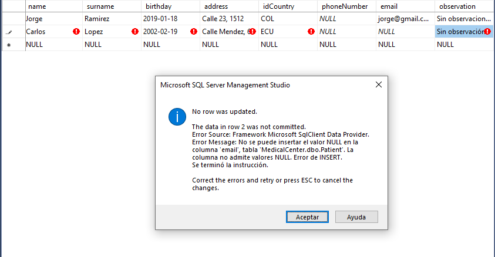

<!--
    - CURSIVA: *italic text*
    - NEGRITA: **strong text**
    - TACHAR: ~~texto tachado~~ (AltGr+4 = ~~)
    - SALTO DE LÍNEA: <p> 'enter' <p>
    - Listas desordenadas (UL):
        * esta
        * es
        * una
        * lista
        * desordenada
    - Lista ordenada numérica:
    1. uno
    2. dos
    .
    .
    .
    n. item
    - Items dentro de items:
    * id1
        * sub_id1
    1. id1
        1. sub_id1
    1. id1
        * sub_id1 (Y VICEVERSA)
    - ENLACES
    Webs: [text](https://www.google.com "Alternative text")
    Imágenes: 
    - CITAS
    > this is a quote
    - SALTO DE LÍNEA <hr>
    --- o ___
    - CÓDIGO:
    `console.log('this is a codeline')`
    Bloque de código:
    ```(lenguaje de programación utilizado)
    code block
    ```
    TABLAS:

    |Tables       |Are         |Cool   |
    |-------------|:-----------|------:|
    |col 3 is     |right-alined|$1600  |
    |col 2 is     |centered    |$12    |
    |zebra stripes|are neat    |$1     |

    GitHub MD
    To Do:
    * [x] Task 1
    * [ ] Task 2
    * [x] Task 3
    Emoji:
    https://gist.github.com/rxaviers/7360908
    Etiquetar a otros perfiles:
    @team_member

    ENLACE ADICIONAL: https://docs.github.com/es/get-started/writing-on-github/getting-started-with-writing-and-formatting-on-github/basic-writing-and-formatting-syntax
-->

# SESIÓN 6: Manipulación de registros DML: INSERT Y SELECT

El objetivo de la sesión es aprender a utilizar los registros DML a la hora de manipular una BBDD

## Sentencia INSERT en SSMS

### Instrucciones para añadir información a una tabla

1. Ubica la tabla deseada y dale click derecho

2. Selecciona la opción _"Edit Top 200 Rows"_

3. Rellenamos los datos correspondientes
   - Si quieres eliminar una fila, solo pulsa la tecla **_Supr_** en tu teclado y luego confirmas la operación.

### Instrucciones para visualizar los 1000 primeros registros en una tabla

1. Ubica la tabla en la que desees trabajar y dale click derecho.

2. Selecciona la opción _"Select Top 1000 Rows"_ y **listo**.

#### Inciso: Comprobación de la Restricción FK Country Patient

1. Para ello nos ubicaremos en la tabla **Patient** y seleccionaremos la opción _Edit Top 200 Rows_

   > Si una columna esta definida con la propiedad **_IDENTITY_**, SSMS no nos permitirá otorgarle algún valor, ya que este se autoincrementara en base a los registros realizados

2. Realizamos un registro dentro de **Patient** con un país existente en la tabla **Country** llenando el dato correspondiente en la columna **idCountry** y en teoría no nos debería de dar error.

   - Si no cumplimos esto nos saltará la siguiente advertencia.

     

### SELECT FORM

**Select** nos permite **_seleccionar_** uno o más registros de una tabla, para ello se deben de especificar los campos correspondientes o un **_\*_** para que se nos devuelvan todos los campos. Presionamos la tecla **F5** para **ejecutar** la sentencia.

```SQL
SELECT [cols] or [*] FROM [table]
```

### Sentencia INSERT usando TRANSACSQL

Nos ayuda a la hora de **_añadir_** información a una tabla. Una buena práctica a la hora de utilizar esta sentencia es siempre especificar los nombres de los campos a la hora de insertar los datos requeridos.

```SQL
INSERT into Patient (dni, name, surname, birthday, address, idCountry, phoneNumber, email, observation)
VALUES ('33521569', 'Leandro', 'Paredes', '1982-05-20', 'Calle Piedras 150', 'ARG', NULL, 'leandro@gmail.com', ''), (new info), ...
```

> [!IMPORTANT]
>
> Si una columna esta declarada como **NOT NULL** es imprescindible darle un dato, sino no se podrá ejecutar la sentencia.
>
> Además, si una columna esta declarado con la propiedad **IDENTITY** no es necesario especificarla a la hora de añadir nueva información a la tabla, ya que esta se autocompletara.

### Sentencia INSERT y Primary Key

Las Primary Key no permite tener valores iguales dentro de esa columna, para así evitar errores a la hora de seleccionar elementos.

```SQL
Msg 2627, Level 14, State 1, Line 3
Infracción de la restricción PRIMARY KEY 'PK_SAMPLE'. NO se puede insertar una clave duplicada en el objeto 'dbo.SAMPLE'. El valor de la clave duplicada es (SAMPLE).
```

#### Ejercicio: Insertar registros en la tabla stateDuty

```SQL
INSERT INTO StateDuty (idState, description)
VALUES (0, 'Pendiente'), (1, 'Realizado'), (2, 'Cancelado'), (3, 'Rechazado'), (4, 'Postergado'), (5, 'Anulado'), (6, 'Derivado')
```

#### Ejercicio: Insertar registros en la tabla Duty

```SQL
INSERT INTO Duty (dutyTime, state, observation)
VALUES ('2023-03-15 00:00:00.000', 0, 'Paciente en ayunas')
```

- Luego se inserta un nuevo registro en la tabla **PatientDuty** utilizando el INSERT anterior.

```SQL
INSERT INTO PatientDuty (idDuty, idPatient, idDoctor)
VALUES (4, 6, 1)
```

#### Ejercicio: Insertar registros en la tabla Payment, PaymentPatient, Concept

- Concept:
  ```SQL
  INSERT INTO Concept (description)
  VALUES ('Laboratorio'), ('Radiografía')
  ```
- Payment:
  ```SQL
  INSERT INTO Payment (concept, datePayment, amount, state, observation)
  VALUES (1, '2019-02-15 00:00:00.000', 4500, 0, 'Pago Pendiente'),
  (2, '2019-05-20 00:00:00.000', 6800, 0, 'Pago Pendiente'),
  (1, '2019-09-27 00:00:00.000', 5600, 0, 'Pago Pendiente')
  ```
- PatientPayment:
  ```SQL
  INSERT INTO PatientPayment (idPayment, idPatient, idDuty)
  VALUES (5,6,4), (7,1,4), (6,8,4)
  ```

#### Ejercicio: Insertar registros en la tabla Speciality

```SQL
INSERT INTO Speciality (speciality)
VALUES ('Traumatología'), ('Clínica Médica'), ('Gastroenterología'), ('Pediatría')
```
