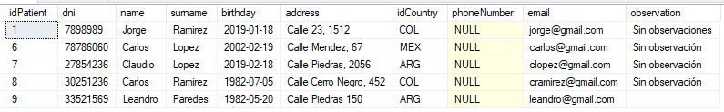
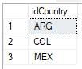
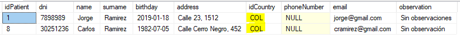

# CLÁUSULAS SQL

## TOP

Se utiliza a la hora de **_obtener_** los primeros datos de una tabla, la sintáxis es:

```SQL
SELECT TOP [# de registros que quieres obtener] [fields or *] FROM [table]
```

## ORDER BY

Sirve si queremos **_ordenar_** una tabla según un criterio específico. Por defecto lo realiza de manera **_ascendente_**, así que si queremos que se ordene de manera _descendente_ lo tenemos que especificar con la palabra _DESC_.

```SQL
SELECT [fields or *] FROM [tables] ORDER BY [rule fields] (DESC)
```

### Combinación entre TOP y ORDER BY

```SQL
SELECT TOP [# de registros que quieres obtener] [fields or *] FROM [tables] ORDER BY [rule fields] (DESC)
```

## DISTINCT

Nos ayuda a **_visualizar_** las filas con datos no repetidos usando un campo como criterio.

Por ejemplo, si utilizamos un `SELECT * FROM Patient` nos imprime lo siguiente:


Ahora, si usamos la cláusula DISTINCT sobre el campo idCountry...

```SQL
SELECT DISTINCT idCountry FROM Patient
```

... nos arroja lo siguiente:



No es otra cosa que los **ÚNICOS** países que están presentes en la tabla _Patient_.

## GROUP BY

Nos sirve a la hora de **_agrupar_** los valores de un determinado campo con la particularidad de que podemos usar algunas funciones adicionales. Es muy similar a DISTINCT.

```SQL
SELECT [field] FROM [table] GROUP BY [field]
```

## WHERE

Nos sirve para **_buscar_** determinados registros en una tabla utilizando como referencia un campo y el valor que queremos usar como filtro sobre ese campo. Por ejemplo, si queremos **obtener todos los pacientes que sean de Colombia**, utilizaremos la siguiente sentencia:

```SQL
SELECT * FROM Patient WHERE idCountry = 'COL'
```

Obteniendo la siguiente respuesta:

