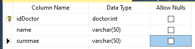
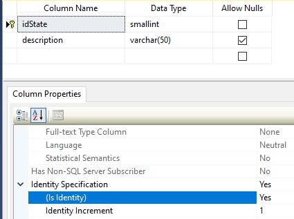
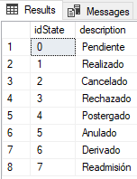
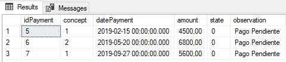
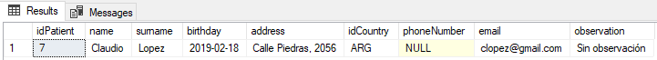

# MANIPULACIÓN DE REGISTROS DML CON UPDATE Y DELETE

## Comando UPDATE

Nos sirve a la hora de **_actualizar registros y campos_** dentro de una tabla.

Sintáxis para un UPDATE másivo

```SQL
UPDATE [table] SET [field] = {actualización}
```

Si queremos **mayor especifidad**, tenemos que unir la cláusula **_WHERE_** en la consulta, para así solo afectar a un grupo reducido de datos.

```SQL
UPDATE [table] SET [field] = {actualización} WHERE [field] = {data}
```

También podemos realizar más de una actualización a la vez, solo debemos de separarlos con una _coma_.

```SQL
UPDATE [table] SET [field] = {actualización}, [field] = {actualización}, ..., [field] = {actualización} WHERE [field] = {requeriment}
```

## Comando DELETE

Nos sirve para **_eliminar_** registros de nuestra tabla.

> [!WARNING]
>
> Si dejamos esta consulta así: `DELETE FROM [table]` estaríamos eliminando **TODOS** los registros de la _table_, siendo algo contraproducente ya que **COLAPSARÍA** la BBDD.

La sintáxis correcta es:

```SQL
DELETE FROM [table] WHERE [field] = {requeriment}
```

#### EJERCICIO: Insertar un nuevo Duty (Relacionado con la siguiente clase)

```SQL
INSERT INTO Duty (dutyTime, state, observation)
VALUES ('2019-01-22 10:00', 0, 'Turno pendiente de aprobación')
```

- Ahora, añadimos un nuevo registro a la tabla **PatientDuty** utilizando el registro anterior.
  ```SQL
  INSERT INTO PatientDuty (idDuty, idPatient, idDoctor)
  VALUES (6,9,1)
  ```

### DELETE y su relación con las Foreign Keys.

Si intentas eliminar un dato que esta relacionada con otra tabla como una FK, esto no podrá ocurrir debido a la restricción REFERENCE. Aparece lo siguiente:

> **_Msg 547, Level 16, State 0, Line 5_**
>
> Instrucción **DELETE** en conflicto con la restricción REFERENCE **_'FK_PatientPayment_Patient'_**. El conflicto ha aparecido en la base de datos **'MedicalCenter'**, tabla **'dbo.PatientPayment'**, column **'idPatient'**.

Esto se da para proteger la integridad de los datos, y que no hayan tablas con registros inconsistentes.

Si quieres aun así quieres eliminar ese dato, tienes que hacer lo siguiente:

1. Ir a la tabla relacional y eliminar ese registro.
2. Ir a las tablas donde están los datos relacionados y elimina esos registros.

#### EJERCICIO: Eliminar un Duty

1. Eliminamos el **PatientDuty** correspondiente al _Duty_ que queremos eliminar.
   ```SQL
   DELETE FROM PatientDuty WHERE idDuty = 4
   ```
2. Eliminamos el **Duty** correspondiente
   ```SQL
   DELETE FROM Duty WHERE idDuty = 4
   ```

#### Propiedad ALLOW NULLS en Doctor

1. Desmarcamos la propiedad _Allow Nulls_ en la tabla **Doctor**
   

2. Finalmente para comprobar que dichos campos son obligatorios, deberás generar una sentencia INSERT con valor NULL en cualquiera de los dos campos, o en ambos.
   ```SQL
   INSERT INTO Doctor (name, surname)
   VALUES (NULL, 'Espinoza')
   ```
   Nos sale este error:
   > Msg 515, Level 16, State 2, Line 1
   >
   > No se puede insertar el valor **NULL** en la columna **'name'**, tabla **'MedicalCenter.dbo.Doctor'**. La columna no admite valores **NULL**. Error de **INSERT**.

#### Establecer la propiedad IDENTITY en la tabla StateDuty

1. Establecer el cambio de propiedad
   

2. Comprobamos la autonumeración con un **INSERT**

   ```SQL
   INSERT INTO StateDuty (description) VALUES ('Readmisión')
   ```

   

3. Eliminamos ese registro
   ```SQL
   DELETE FROM StateDuty WHERE idState = 7
   ```

#### EJERCICIO: Realizar una consulta ORDER BY en la tabla Payment usando la columna datePayment como criterio de orden

```SQL
SELECT * FROM Payment ORDER BY datePayment
```



#### EJERCICIO: Consultamos el PATIENT más joven con las cláusulas TOP y ORDER BY

```SQL
SELECT TOP 1 * FROM Patient ORDER BY birthday DESC
```


